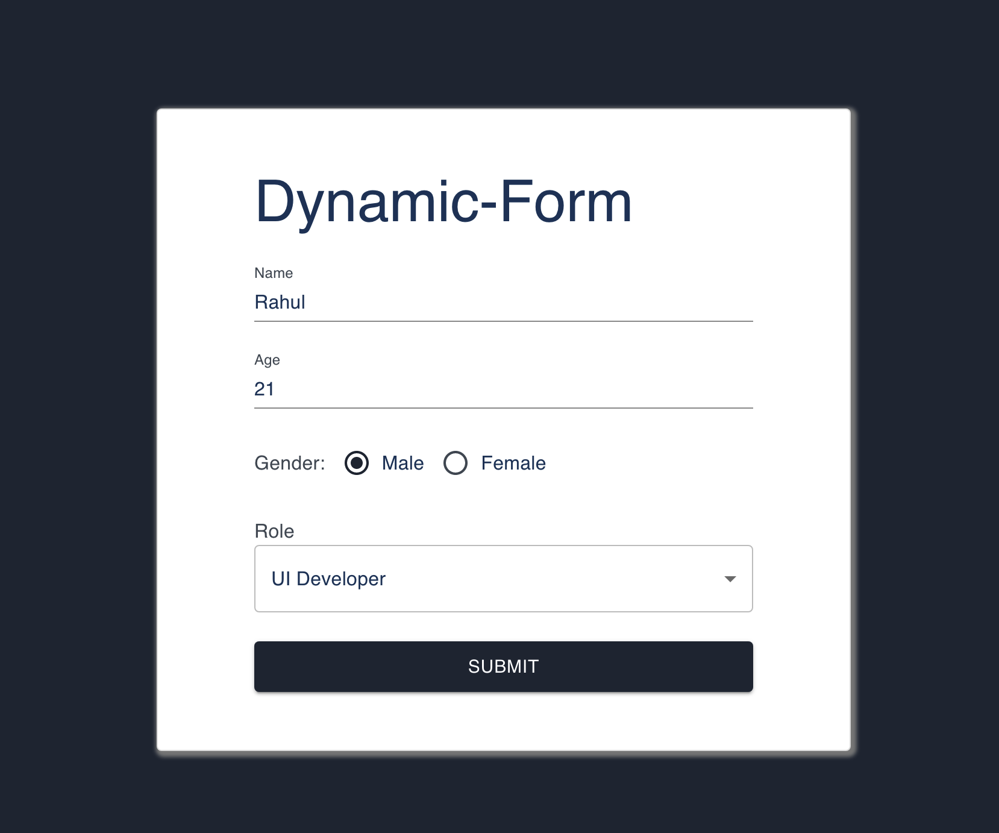
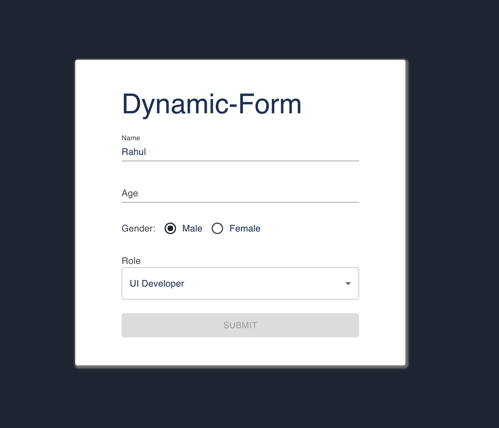
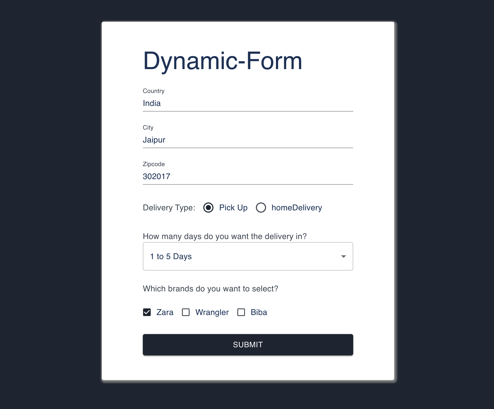
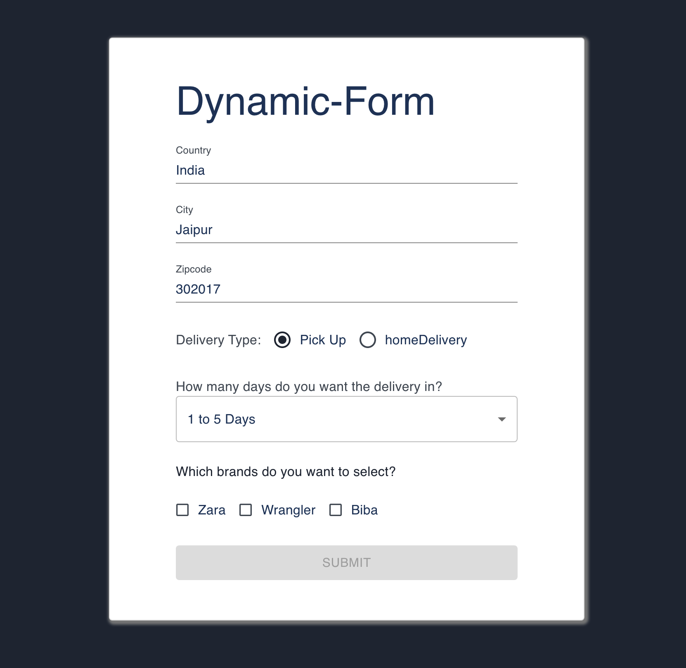

# React-Redux-Assignment

Hosted [Website Link](https://surjeet-dynamic-react-redux-form-0.netlify.app/) for [API](https://run.mocky.io/v3/a55c4590-c635-49af-a01f-7ee2e6a85669): https://surjeet-dynamic-react-redux-form-0.netlify.app

Hosted [Website Link](https://surjeet-dynamic-react-redux-form.netlify.app/) for [API](https://run.mocky.io/v3/7ec8da10-b0ee-4016-86a0-100925968a0c): https://surjeet-dynamic-react-redux-form.netlify.app

Steps to run the code:

1. Clone this repo and then run following commands in terminal

```
cd react-dynamic-form
npm install
npm start
```

The app will open at [LocalHost](http://localhost:3000) at port 3000.

Note: According to our use case API url can be change in file [formSlice.js](./react-dynamic-form/src/store/formSlice.js).

Sample output for [API](https://run.mocky.io/v3/a55c4590-c635-49af-a01f-7ee2e6a85669)



With disabled Button



Sample output for [API](https://run.mocky.io/v3/7ec8da10-b0ee-4016-86a0-100925968a0c)



With Disabled Button


